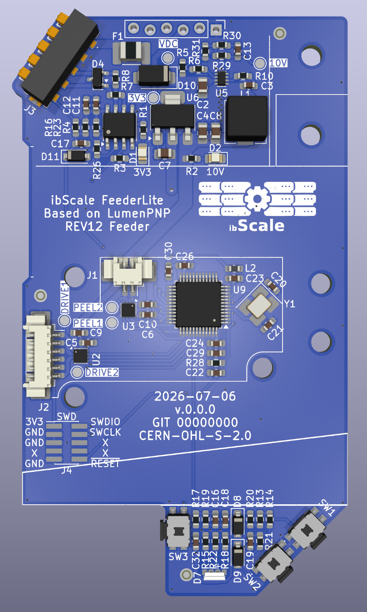

# ibScaleFeederLite

`ibScaleFeederLite` is an updated version of the [Opulo LumenPNP Rev 12 Feeder](https://github.com/opulo-inc/feeder) motherboard with several enhancements pulled from the [ibScale Micropython Feeder](https://github.com/ibScale/ibScaleMPFeeder) motherboard.



## What's different from the Rev 12 motherboard

### PCB Stackup
The PCB was changed to a 4-layer stackup with 7628 prepreg. The cost difference is negligible compared to the original 2-layer stackup. This allows for a cleaner layout with improved routing and component placement. The bottom layer of the PCB is kept as a ground layer only with no traces. Since this layer of the PCB is exposed it is very likely to get knicked, scratched, or otherwise damaged by the environment. This prevents any minor damage from affecting the operation of the feeder.

### DC/DC buck converter
The original OnSemi MC34063AD design used a 100µF input and 470µF output electrolytic capacitors. These capacitors are relatively expensive and difficult to source in low-profile heights suitable for the 8mm feeders. The large 100uF input capacitance would also cause arcing during insertion from the inrush current while charging. In addition to this, if the LumenPNP had 50 feeders plugged in the excessive bus capacitance would cause power sag (brown out) or potentially even trip the over-current protection. If the over-current protection does trip then the LumenPNP will boot loop as the 24V DC supply resets.

A Texas Instruments TPS563300 with MLCC capacitors has replaced the original design. The input capacitance has been reduced to 10uF to help prevent arcing during insertion. The reduced capacitance also helps mitigate the excessive bus capacitance start-up issue. A 0.75A PPTC fuse (F1) and diode (D1) have also been added to provide over-current and reverse-current protection.

### RS-485 transceiver
The AD/Maxim MAX3078E transceiver is the single most expensive component on the Opulo Rev12 feeder. Since the LumenPNP only operates at 57600bps there is no need to have an expensive part. The new TI THVD1400D transceiver is about 1/10th the cost and more then adequate for this application.

### Status LED
The RGB status LED has been changed to a Lite-On LTST-S33FBEGW-5A. This LED has a translucent diffuser and is designed for low current applications. It is available from a variety of suppliers and is an overall better quality indicator.

### Buttons
The original buttons were probably one of the biggest pain points on the original Rev12 design. These have been upgraded to Diptronics PTCF-V-T/R with J-hook stems. These switches are larger and available from a variety of suppliers. This along with improved debounce circuitry provide a better user experience.

### SWD connector
The original placement of the SWD connector made it difficult to use commonly available POGO pin clips like the Adafruit 5434. The connector was rotated and moved to the edge of the PCB to make using POGO pin clips easier. The rear SWD connector was removed.

## Hardware overview

| Function | Part |
|---|---|
| MCU | STM32F031C6T6 (Arm Cortex-M0, 48 MHz, 32 KB flash) |
| Motor drivers (Drive / Peel) | 2x TI DRV8837 |
| RS-485 transceiver | TI THVD1400D |
| Buck regulator | TI TPS563300 |
| Status LED | Lite-On LTST-S33FBEGW-5A |
| UP/DOWN/BOOT switches | Diptronics PTCF-V-T/R |

## Repository structure

```
ibScaleFeederLite/
├── ibScaleFeederLite.kicad_pro   KiCad project file
├── ibScaleFeederLite.kicad_pcb   PCB layout
├── ibScaleFeederLite.kicad_sch   Schematic
├── library/                      Project-specific symbols, footprints, and 3D models
└── references/                   Component datasheets
```

## Opening the project

Requires [KiCad](https://www.kicad.org/) 10 or newer. Open `ibScaleFeederLite.kicad_pro` to get started.

All custom symbols, footprints, and 3D models used by the project are included in `library/` and referenced via the project-local `sym-lib-table` and `fp-lib-table`, so no additional library setup is required.

## Bill of materials

Every component includes the manufacturer's name and part number, along with DigiKey, Mouser, and LCSC part numbers. To export a BOM, use KiCad's schematic editor: **Tools → Generate Bill of Materials**.

## License

Released under the [CERN Open Hardware Licence Version 2 - Strongly Reciprocal (CERN-OHL-S-2.0)](LICENSE.txt), consistent with the licensing of the original Opulo LumenPNP hardware it is derived from.
